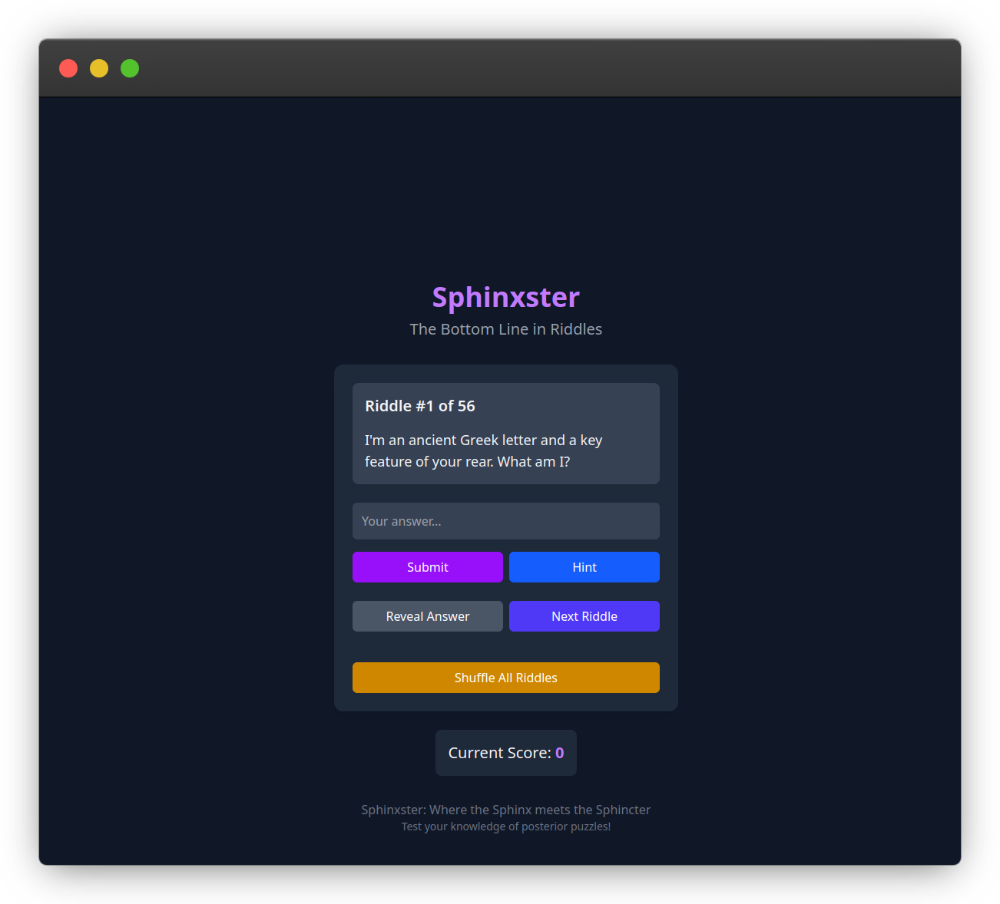

# Sphinx-ster 🧠🍑

Where Sphinx meets Sphincter - The Bottom Line in Riddles

[](https://lwalker.me/sphinxster/index.html)

Ever thought the ancient Sphinx's riddles needed more posterior humor? Neither did we, until now! 

Sphinx-ster is what happens when you combine riddles with rear-end jokes - a truly cheeky experiment that proves even AI can have a sense of humor that falls flat. This project emerged from a conversation where a friend's impressive posterior knowledge made them the butt of too many jokes.

**WARNING**: This app contains rear-end humor that might cause you to:
- Snicker inappropriately
- Question your life choices
- Learn more about gluteal anatomy than you ever wanted to

## Features

- 50+ posterior-themed riddles that will test your derrière deduction skills
- Score tracking to show off your bottom-line brilliance
- Hint system for when you're feeling behind
- Shuffle feature to keep your cheeks guessing

## Disclaimer

This project is not intended to be taken seriously. It was part of an AI code generation experiment and is meant purely for light posterior amusement. If you're offended by butt jokes, this probably isn't for you. If you're not offended by butt jokes, you should probably still question your life choices.

## Contributing

Please don't. We've embarrassed ourselves enough already.

## Development

```bash
# Clone the repo (if you really must)
git clone https://github.com/ozskywalker/sphinxster.git

# Install dependencies
npm install

# Run locally (at your own risk)
npm run dev
```

## Deployment

1. `npm build`
2. `cd dist/`
3. `aws s3 sync . s3://<s3bucket_of_choice>/sphinxster/`

*Note: Subdirectory is defined via `.env` & `vite.config.js`*

## Tech Stack

- Claude 3.7 Sonnet (AI assistant with questionable training data to generate this)
- React (for rendering dad jokes as components)
- Vite (because this app needed to be built quickly before anyone came to their senses)
- TailwindCSS (making buttcracks look stylish since 2023)

## License

This project is licensed under the "Please Don't Judge Us" License.

---

*Remember: What happens in Sphinx-ster, stays in Sphinx-ster. Just like food in your digestive tract... until it doesn't.*
